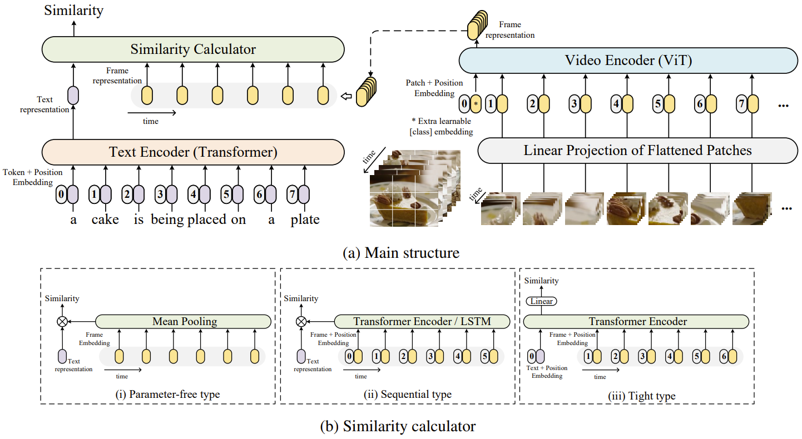

# CLIP4Clip: An Empirical Study of CLIP for End to End Video Clip Retrieval

The implementation of paper [**CLIP4Clip: An Empirical Study of CLIP for End to End Video Clip Retrieval**](https://arxiv.org/abs/2104.08860). 

CLIP4Clip is a video-text retrieval model based on [CLIP (ViT-B)](https://github.com/openai/CLIP). We investigate three similarity calculation approaches: parameter-free type, sequential type, and tight type, in this work. The model achieve SOTA results on MSR-VTT, MSVD, LSMDC, ActivityNet, and DiDeMo.



## Requirement

1. Run `pip install -r requirement.text` to install the exactly same dependencies.

2. Or use `conda-pack` command to install the environment downloaded from [here](https://pan.baidu.com/s/18qtdMb6OGqEwnyIGONCk8A) with [0dhw]:
    ```bash
    pip install conda-pack
    mkdir -p [path_to_conda_env]    # (e.g., ~/anaconda/envs/ENV_NAME)
    tar -zxvf [ENV_NAME].tar.gz -C [path_to_conda_env]
    ```

## Data Preparing

**1. For MSRVTT**

The official data and video links can be found in [link](http://ms-multimedia-challenge.com/2017/dataset). 

For the convenience, you can also download the splits and captions by,
```sh
wget https://github.com/ArrowLuo/CLIP4Clip/releases/download/v0.0/msrvtt_data.zip
```

Besides, the raw videos can be found in [sharing](https://github.com/m-bain/frozen-in-time#-finetuning-benchmarks-msr-vtt) from *Frozen️ in Time*, i.e.,
```sh
wget https://www.robots.ox.ac.uk/~maxbain/frozen-in-time/data/MSRVTT.zip
```

**2. For MSVD**

Raw videos can be download from [link](https://www.cs.utexas.edu/users/ml/clamp/videoDescription/). 

The splits and `raw_captions` can be found in the wonderful job [collaborative-experts](https://github.com/albanie/collaborative-experts/blob/master/misc/datasets/msvd/README.md). For the convenience, you can also download them by,
```sh
wget https://github.com/ArrowLuo/CLIP4Clip/releases/download/v0.0/msvd_data.zip
```

## Compress Video (optional)

**Our UniPT adopts this operation for Speed-up.**
```sh
python preprocess/compress_video.py --input_root [raw_video_path] --output_root [compressed_video_path]
```
This script will compress the video to *3fps* with width *224* (or height *224*). Modify the variables for your customization.

## Training and Testing

1. Download CLIP (ViT-B/32) weight into `CLIP4Clip/modules/ViT-B-32.pt`.
```sh
wget -P ./modules https://openaipublic.azureedge.net/clip/models/40d365715913c9da98579312b702a82c18be219cc2a73407c4526f58eba950af/ViT-B-32.pt
```

2. Then run `./train_xxxx_tuning.sh` to obtain the corresponding model in `ckpts/`. 

3. One can download our best checkpoints of [MSR-VTT](https://pan.baidu.com/s/1QnRHk_b03X2BEonnqr7XUQ) and [MSVD](https://pan.baidu.com/s/1rZocVRZwnDD5M5bnsQFWAA) with [0dhw].


# Acknowledgments
Our code is based on [CLIP](https://github.com/openai/CLIP) and [UniVL](https://github.com/microsoft/UniVL).
