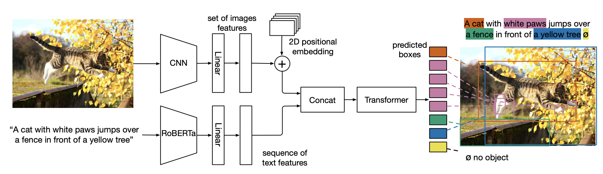

**MDETR**: Modulated Detection for End-to-End Multi-Modal Understanding
========

[Website](https://ashkamath.github.io/mdetr_page/) • [Colab](https://colab.research.google.com/drive/11xz5IhwqAqHj9-XAIP17yVIuJsLqeYYJ?usp=sharing) • [Paper](https://arxiv.org/abs/2104.12763)


This repository contains code and links to pre-trained models for MDETR (Modulated DETR) for pre-training on data having aligned text and images with box annotations, as well as fine-tuning on tasks requiring fine grained understanding of image and text. 

We show big gains on the phrase grounding task (Flickr30k), Referring Expression Comprehension (RefCOCO, RefCOCO+ and RefCOCOg) as well as Referring Expression Segmentation (PhraseCut, CLEVR Ref+). We also achieve competitive performance on visual question answering (GQA, CLEVR).




**TL;DR**. We depart from the fixed frozen object detector approach of several popular vision + language pre-trained models and achieve true end-to-end multi-modal understanding by training our detector in the loop. In addition, we *only* detect objects that are relevant to the given text query, where the class labels for the objects are just the relevant words in the text query. This allows us to expand our vocabulary to anything found in free form text, making it possible to detect and reason over novel combination of object classes and attributes.
                

For details, please see the paper: [MDETR - Modulated Detection for End-to-End Multi-Modal Understanding](https://arxiv.org/abs/2104.12763) by Aishwarya Kamath, Mannat Singh, Yann LeCun, Ishan Misra, Gabriel Synnaeve and Nicolas Carion.

Aishwarya Kamath and Nicolas Carion made equal contributions to this codebase. 

## Referring expression comprehension
Instructions for data preparation and script to run finetuning and evaluation can be found at [Referring Expression Instructions](.github/refexp.md)

# License
MDETR is released under the Apache 2.0 license. Please see the [LICENSE](LICENSE) file for more information.

# Citation 
If you find this repository useful please give it a star and cite as follows! :) :
```
    @article{kamath2021mdetr,
      title={MDETR--Modulated Detection for End-to-End Multi-Modal Understanding},
      author={Kamath, Aishwarya and Singh, Mannat and LeCun, Yann and Misra, Ishan and Synnaeve, Gabriel and Carion, Nicolas},
      journal={arXiv preprint arXiv:2104.12763},
      year={2021}
    }
```
