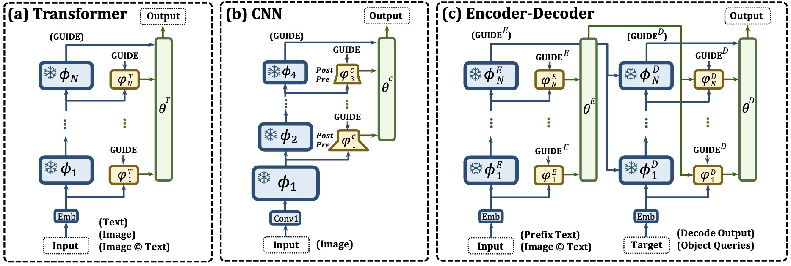

# UniPT
*PyTorch implementation of [**“UniPT: Universal Parallel Tuning for Transfer Learning with Efficient Parameter and Memory”**](https://arxiv.org/abs/2308.14316).* 

*It is built on top of the [VSE$\infty$](https://github.com/woodfrog/vse_infty), [CLIP-ViL](https://github.com/clip-vil/CLIP-ViL), [CLIP4Clip](https://github.com/ArrowLuo/CLIP4Clip), [MDETR](https://github.com/ashkamath/mdetr), [LST](https://github.com/ylsung/Ladder-Side-Tuning) and [Awesome_Pretraining_Transfering](https://github.com/Paranioar/Awesome_Cross_Modal_Pretraining_Transfering).* 

*If any problems, please contact me at r1228240468@gmail.com. (diaohw@mail.dlut.edu.cn is deprecated)*

## Introduction

**The framework of UniPT:**

Overview of the Framework with (a) parallel interaction ($\varphi$) and (b) confidence aggregation ($\theta$) layers. The former attempts to extract more discriminative features at each layer independently guided by the relatively most powerful output features, while the latter learns a dynamic and optimal combination strategy over the blended features at each layer for the ultimate domain adaptation.

## Task & Model Details

**Image-Text Retrieval: *[VSE$\infty$]("./VSE-infty/README.md")*** with the strongest combination of BERT-base model and ResNeXt-101(32×8d) backbone pre-trained on Instagram (WSL).

**Video-text Retrieval: *[CLIP4Clip]("./CLIP4Clip/README.md")*** with pre-trained CLIP network using Text Transformer and ViT-B/32 models.

**Question Answering: *[CLIP-ViL]("./CLIP-ViL/README.md")*** that utilizes CLIP image backbone and encodes the text into word embedding sequence, followed by a cross-modal Transformer.

**Visual Grounding: *[MDETR]("./MDETR/README.md")*** with pre-trained ResNet-101 vision encoder, RoBERTa-base text encoder, and query-based encoder-decoder Transformer.

Please refer to their respective README.md file for the detailed settings.

## Guidance for Applications
I summarize the positions where UniPT is defined and invoked in each work as follows:
**I hope these help you quickly realize your idea beyond UniPT.**

1. **CLIP-ViL**: UniPT is defined and called at **class LXRTEncoder(nn.Module)** from [CLIP-ViL/src/lxrt/modeling.py](https://github.com/Paranioar/UniPT/blob/main/CLIP-ViL/src/lxrt/modeling.py).

2. **CLIP4Clip**: UniPT is defined at [CLIP4Clip/modules/module_adapter.py](https://github.com/Paranioar/UniPT/blob/main/CLIP4Clip/modules/module_adapter.py), and called at **Line 251-261** from [CLIP4Clip/modules/modeling.py](https://github.com/Paranioar/UniPT/blob/main/CLIP4Clip/modules/modeling.py).

3. **VSE$\infty$**: UniPT is defined at [VSE-infty/lib/adapter_for_cnn.py](https://github.com/Paranioar/UniPT/blob/main/VSE-infty/lib/adapter_for_cnn.py) and [VSE-infty/lib/adapter_for_transformer.py](https://github.com/Paranioar/UniPT/blob/main/VSE-infty/lib/adapter_for_transformer.py), and called at [VSE-infty/lib/encoders.py](https://github.com/Paranioar/UniPT/blob/main/VSE-infty/lib/encoders.py).

4. **MDETR**: UniPT is defined and called at **class Transformer(nn.Module)** from [MDETR/models/transformer.py](https://github.com/Paranioar/UniPT/blob/main/MDETR/models/transformer.py).

## Reference

If UniPT is useful for your research, please cite the following paper:

      @article{Diao2023UniPT,
          title={UniPT: Universal Parallel Tuning for Transfer Learning with Efficient Parameter and Memory},
          author={Diao, Haiwen and Wan, Bo and Zhang, Ying and Jia, Xu and Lu, Huchuan and Chen, Long},
          journal={arXiv preprint arXiv:2308.14316},
          year={2023}
      }

## License

[Apache License 2.0](http://www.apache.org/licenses/LICENSE-2.0).  
