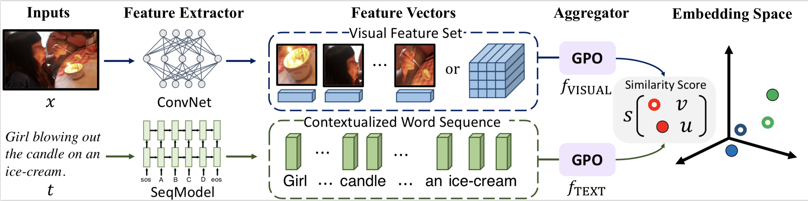

# Learning the Best Pooling Strategy for Visual Semantic Embedding

 [](https://opensource.org/licenses/MIT) 

Official PyTorch implementation of the paper [Learning the Best Pooling Strategy for Visual Semantic Embedding](https://arxiv.org/abs/2011.04305) (**CVPR 2021 Oral**).

Please use the following bib entry to cite this paper if you are using any resources from the repo.

```
@inproceedings{chen2021vseinfty,
     title={Learning the Best Pooling Strategy for Visual Semantic Embedding},
     author={Chen, Jiacheng and Hu, Hexiang and Wu, Hao and Jiang, Yuning and Wang, Changhu},
     booktitle={IEEE Conference on Computer Vision and Pattern Recognition (CVPR)},
     year={2021}
} 
```


We referred to the implementations of [VSE++](https://github.com/fartashf/vsepp) and [SCAN](https://github.com/kuanghuei/SCAN) to build up our codebase. 


## Introduction



Illustration of the standard Visual Semantic Embedding (VSE) framework with the proposed pooling-based aggregator, i.e., Generalized
Pooling Operator (GPO). It is simple and effective, which automatically adapts to the appropriate pooling strategy given different data
modality and feature extractor, and improves VSE models at negligible extra computation cost.

## Preparation

### Environment

1. Run `pip install -r requirement.text` to install the exactly same dependencies.

2. Or use `conda-pack` command to install the environment downloaded from [here](https://pan.baidu.com/s/1WsNh_CJJXPak_I4rgobXNQ) with [0dhw]:
    ```bash
    pip install conda-pack
    mkdir -p [path_to_conda_env]    # (e.g., ~/anaconda/envs/ENV_NAME)
    tar -zxvf [ENV_NAME].tar.gz -C [path_to_conda_env]
    ```

### Data

We organize all data used in the experiments in the following manner:

```
data
├── coco
│   ├── precomp  # pre-computed BUTD region features for COCO, provided by SCAN
│   │      ├── train_ids.txt
│   │      ├── train_caps.txt
│   │      ├── ......
│   │
│   ├── images   # raw coco images
│   │      ├── train2014
│   │      └── val2014
│   │
│   ├── cxc_annots # annotations for evaluating COCO-trained models on the CxC benchmark
│   │
│   └── id_mapping.json  # mapping from coco-id to image's file name
│   
│
├── f30k
│   ├── precomp  # pre-computed BUTD region features for Flickr30K, provided by SCAN
│   │      ├── train_ids.txt
│   │      ├── train_caps.txt
│   │      ├── ......
│   │
│   ├── flickr30k-images   # raw coco images
│   │      ├── xxx.jpg
│   │      └── ...
│   └── id_mapping.json  # mapping from f30k index to image's file name
│   
├── weights
│      └── original_updown_backbone.pth # the BUTD CNN weights
│
└── vocab  # vocab files provided by SCAN (only used when the text backbone is BiGRU)
```

The download links for original COCO/F30K images, precomputed BUTD features, and corresponding vocabularies are from the offical repo of [SCAN](https://github.com/kuanghuei/SCAN#download-data). The ```precomp``` folders contain pre-computed BUTD region features, ```data/coco/images``` contains raw MS-COCO images, and ```data/f30k/flickr30k-images``` contains raw Flickr30K images. 

The ```id_mapping.json``` files are the mapping from image index (ie, the COCO id for COCO images) to corresponding filenames, we generated these mappings to eliminate the need of the ```pycocotools``` package. 

```weights/original_updowmn_backbone.pth``` is the pre-trained ResNet-101 weights from [Bottom-up Attention Model](https://github.com/peteanderson80/bottom-up-attention), we converted the original Caffe weights into Pytorch. Please download it from [this link](https://drive.google.com/file/d/1gNdV1Qx_7yYzkhHrzqbP-bbNkdrKw_w1/view?usp=sharing).


The ```data/coco/cxc_annots``` directory contains the necessary data files for running the [Criscrossed Caption (CxC) evaluation](https://github.com/google-research-datasets/Crisscrossed-Captions). Since there is no official evaluation protocol in the CxC repo, we processed their raw data files and generated these data files to implement our own evaluation.  We have verified our implementation by aligning the evaluation results of [the official VSRN model](https://github.com/KunpengLi1994/VSRN) with the ones reported by the [CxC paper](https://arxiv.org/abs/2004.15020) Please download the data files at [this link](https://drive.google.com/drive/folders/1Ikwge0usPrOpN6aoQxsgYQM6-gEuG4SJ?usp=sharing).

Please download all necessary data files and organize them in the above manner, the path to the ```data``` directory will be the argument to the training script as shown below.

## Training

Run the script `./train_xxxx_wsl.sh` and you will obtain the checkpoint in `runs/`.


## Testing

First change the model path in ``eval.py` (weights_bases = ['runs/save_model']).

For evaluting models on COCO, use the following command:

```
CUDA_VISIBLE_DEVICES=0 python3 eval.py --dataset coco --data_path ./data/coco
```

For evaluting models on Flickr-30K, use the command: 

```
CUDA_VISIBLE_DEVICES=0 python3 eval.py --dataset f30k --data_path ./data/f30k
```

## Our checkpoints

One can download our best checkpoints of [f30k](https://pan.baidu.com/s/1kRNd4OlUpO2RQN5xXIkK5Q) and [coco](https://pan.baidu.com/s/1uqJe6f4_Q6c6N9RtCbvSiA) with [0dhw].


